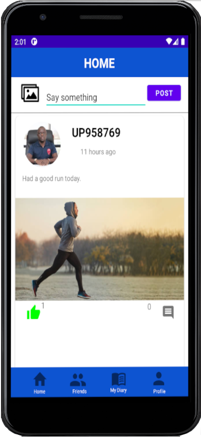
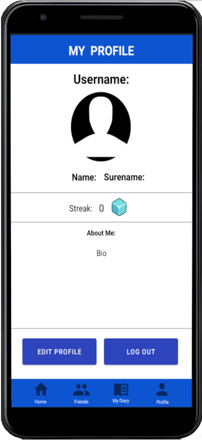
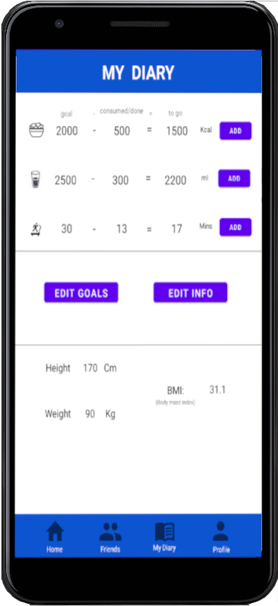
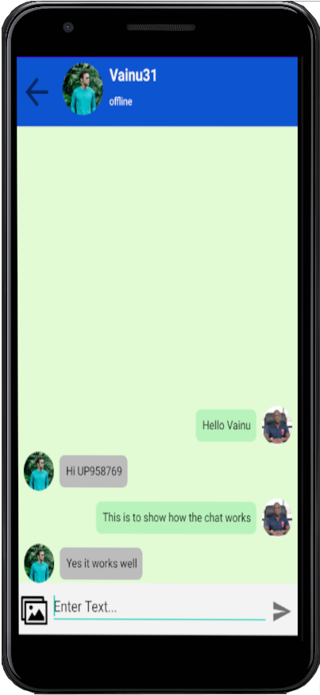
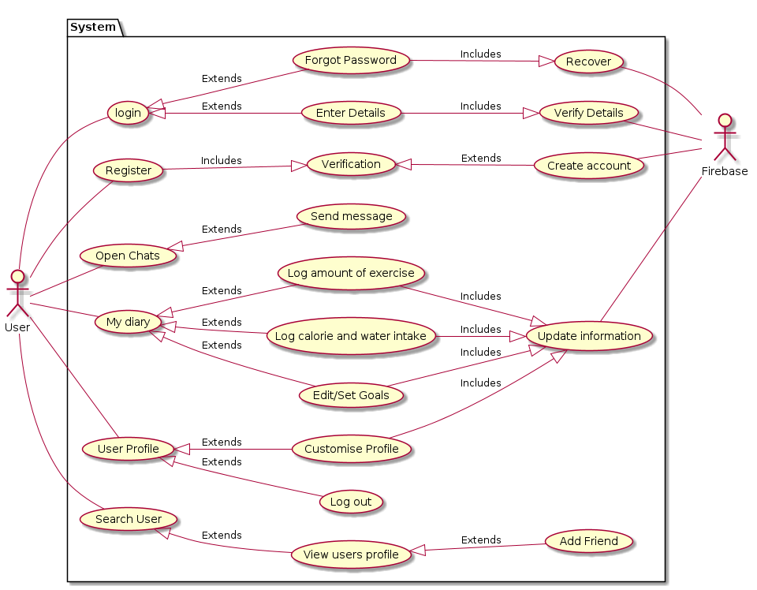

# Social Fitness App

## Introduction
Welcome to the Android Social Fitness App project! This Android app is designed to combat people living a sedentary lifestyle by leveraging social media to motivate people to exercise more and live a more active lifestyle improving everyone’s overall health. The project aims to combine both a traditional fitness app and add some social media elements to it.

## Technologies Used
- Android Studio (Java)
- Google Firebase
- Espresso
- Picasso

## Features
- Customizable User Profile
- Adding Friends and Social Interactions
- Instant Messaging with Friends
- Timeline for User Content and Posting
- Tracking and Goal setting for Calories, Water, Weight, and Exercise
- Notification System
- Streak Tracking for User Activity 
- Authentication (User registration and login)
- Database Integration (Firebase Realtime)

## Screenshots of App

## Use Case Design

## Conclusion
In conclusion, this fitness project has been a journey of innovation and determination. It aimed to address the issue of sedentary lifestyles in the age of social media by leveraging technology to inspire healthier living. Throughout this endeavor, I've encountered various challenges and gained invaluable insights. While the project successfully achieved its primary objectives, there is room for future improvements and enhancements. 

## Usage
Unfortunately a majority of the source code is deprecated / outdated, and the Firebase account that hosted some of the services has been closed.
